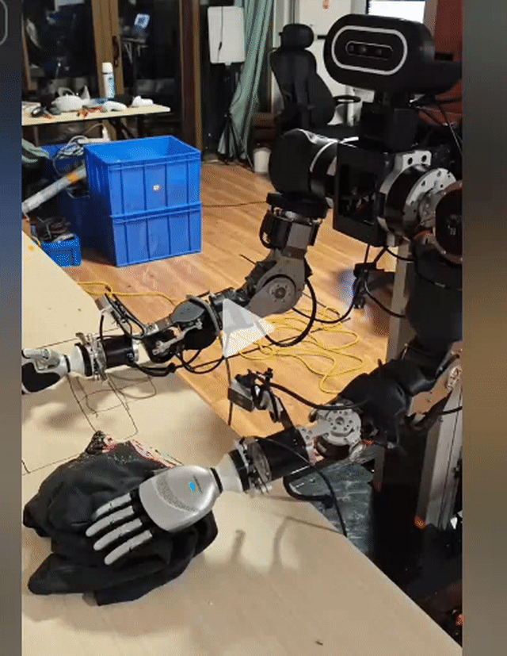

# openarmx_teleop_vr 使用说明（中文）

## 1. 包定位

`openarmx_teleop_vr` 是 OpenArmX 的 ROS 2 VR 遥操作执行节点。

该节点订阅 Pico/VR 桥接节点发布的手柄位姿、头显位姿、握把、扳机、按键和速度档位等话题，读取机器人 `/joint_states`，并调用 `openarmx_arm_driver` 内部的 IK 逻辑计算双臂目标关节角，最终向左右臂 `forward_position_controller` 发布关节位置命令。

整体目标是实现：

```text
Pico/VR 手柄 -> ROS 2 桥接话题 -> openarmx_teleop_vr_node -> openarmx_arm_driver IK -> 双臂控制器
```

关于 VR 设备遥操作的图文教程，请访问官方文档：<http://docs.openarmx.com>

## 2. 包结构

当前包结构如下：

```text
openarmx_teleop_vr/
├── README.md
├── config/
│   └── teleop_params.yaml          # 遥操作参数配置
├── launch/
│   └── teleop_vr.launch.py         # 启动入口
├── openarmx_teleop_vr/
│   ├── __init__.py
│   └── openarmx_teleop_vr_node.py  # 主节点
├── package.xml
├── resource/
│   └── openarmx_teleop_vr
├── setup.cfg
└── setup.py
```

## 3. 系统链路

典型运行链路如下：

1. VR 设备通过桥接包发布控制器数据（`openarmx_teleop_bridge_vr`）。
2. 本节点订阅输入话题，计算左右臂关节控制命令。
3. 控制命令发布到 `forward_position_controller`，驱动仿真或实机。

## 4. 主要功能

1. 支持左右手柄分别控制左右机械臂末端运动。
2. 支持相对和绝对两种 VR 控制输入。
3. 使用握把作为手动控制使能开关，降低误操作风险。
4. 普通夹爪模式下使用扳机控制左右夹爪开合。
5. 支持慢速/快速两档关节步进限制。
6. 支持按钮触发回零、举手。

## 5. 快速启动

### 前置条件

1. 机器人底层（仿真或实机）已启动，且 `forward_position_controller` 可用。
2. VR 桥接节点已启动，并持续发布手柄话题。
3. 运行环境中可导入 `openarmx_arm_driver`（本节点必需依赖）。

### 方式一：普通夹爪（默认模式）

1. 终端 1：启动官方普通夹爪双臂。

```bash
cd <你的工作空间>
source install/setup.bash

# 仿真
ros2 launch openarmx_bringup openarmx.bimanual.launch.py \
  control_mode:=mit \
  robot_controller:=forward_position_controller \
  use_fake_hardware:=true

# 实机：can0/can1 需提前按 1000000 bitrate 启用
ros2 launch openarmx_bringup openarmx.bimanual.launch.py \
  right_can_interface:=can0 \
  left_can_interface:=can1 \
  control_mode:=mit \
  robot_controller:=forward_position_controller \
  use_fake_hardware:=false
```

2. 终端 2：启动 Pico/VR 桥接节点。

```bash
cd <你的工作空间>
source install/setup.bash
ros2 run openarmx_teleop_bridge_vr openarmx_teleop_bridge_vr_node
```

3. 终端 3：使用普通夹爪模型启动 VR。

```bash
cd <你的工作空间>
source install/setup.bash
ros2 launch openarmx_teleop_vr teleop_vr.launch.py \
  controller_pose_mode:=gripper \
  urdf_path:="$(ros2 pkg prefix openarmx_description)/share/openarmx_description/urdf/robot/openarmx_robot.urdf"
```

`gripper` 是默认控制模式。每侧发布 7 个机械臂关节和 1 个夹爪命令，VR 扳机
控制普通夹爪。

### 方式二：O6 灵巧手模式



1. 终端 1：启动带 O6 的机器人底层。

```bash
cd <你的工作空间>
source install/setup.bash

# 仿真；fake arm 会同时使用 fake O6，不启动真实 O6 CAN 驱动
ros2 launch openarmx_hand_bringup openarmx.bimanual.o6.launch.py \
  control_mode:=mit \
  robot_controller:=forward_position_controller \
  use_fake_hardware:=true

# 实机：can0/can1/can2/can3 均需提前按 1000000 bitrate 启用
ros2 launch openarmx_hand_bringup openarmx.bimanual.o6.launch.py \
  right_can_interface:=can0 \
  left_can_interface:=can1 \
  control_mode:=mit \
  robot_controller:=forward_position_controller \
  use_fake_hardware:=false
```

O6 默认使用左手 `can3/0x28`、右手 `can2/0x27`。重力补偿默认关闭；需要时
添加 `enable_forward_effort:=true`，且只能配合 `control_mode:=mit`。

2. 终端 2：按方式一启动同一个 VR bridge。

3. 终端 3：以灵巧手模式启动 VR。

```bash
cd <你的工作空间>
source install/setup.bash
ros2 launch openarmx_teleop_vr teleop_vr.launch.py \
  controller_pose_mode:=hand
```

`hand` 模式每侧只发布 7 个机械臂关节，不通过 VR 控制 O6 手指。O6 手指由
Joint Slider、GUI 或独立控制节点控制。

### O6 多机器人命名空间

如果 O6 bringup 使用了 `robot_namespace:=robot1`，bridge 和 teleop 也必须使用
`/robot1`：

```bash
ros2 run openarmx_teleop_bridge_vr openarmx_teleop_bridge_vr_node \
  --ros-args -r __ns:=/robot1
ros2 launch openarmx_teleop_vr teleop_vr.launch.py \
  controller_pose_mode:=hand robot_namespace:=robot1
```

## 6. 输入与输出话题

下表是未指定命名空间时的完整话题名。指定 `robot_namespace:=robot1` 后，对应
话题位于 `/robot1/...`。

### 相对模式输入话题（默认）

| 话题 | 类型 | 说明 |
|------|------|------|
| `/pico_left_controller/pose` | `geometry_msgs/PoseStamped` | 左手柄相对位姿 |
| `/pico_right_controller/pose` | `geometry_msgs/PoseStamped` | 右手柄相对位姿 |
| `/pico_left_controller/grip` | `std_msgs/Float32` | 左握把，使能左臂控制 |
| `/pico_right_controller/grip` | `std_msgs/Float32` | 右握把，使能右臂控制 |
| `/pico_left_controller/trigger` | `std_msgs/Float32` | 左扳机，控制左夹爪 |
| `/pico_right_controller/trigger` | `std_msgs/Float32` | 右扳机，控制右夹爪 |
| `/pico_left_controller/rate` | `std_msgs/Float32` | 相对模式速度档位 |
| `/pico_right_controller/rate` | `std_msgs/Float32` | 相对模式速度档位 |
| `/pico_right_controller/button_b` | `std_msgs/Bool` | B 键，触发回零动作 |
| `/pico_left_controller/button_y` | `std_msgs/Bool` | Y 键，触发举手动作 |

### 绝对模式输入话题

| 话题 | 类型 | 说明 |
|------|------|------|
| `/vr/head/pose` | `geometry_msgs/PoseStamped` | 头显位姿 |
| `/vr/left/pose_absolute` | `geometry_msgs/PoseStamped` | 左手柄绝对位姿 |
| `/vr/right/pose_absolute` | `geometry_msgs/PoseStamped` | 右手柄绝对位姿 |
| `/vr/left/grip`、`/vr/right/grip` | `std_msgs/Float32` | 左右臂控制使能 |
| `/vr/left/trigger`、`/vr/right/trigger` | `std_msgs/Float32` | 普通夹爪扳机输入 |
| `/vr/calibrate_done` | `std_msgs/Bool` | 绝对模式标定完成信号 |
| `/vr/control_mode` | `std_msgs/String` | VR 控制模式 |
| `/vr/rate` | `std_msgs/Float32` | 绝对模式速度档位 |

### 机器人状态输入

| 话题 | 类型 | 说明 |
|------|------|------|
| `/joint_states` | `sensor_msgs/JointState` | 当前机器人关节角反馈 |

### 输出话题（默认）

| 话题 | 类型 | 说明 |
|------|------|------|
| `/left_forward_position_controller/commands` | `std_msgs/Float64MultiArray` | `gripper` 模式为 7 轴+夹爪，`hand` 模式为 7 轴 |
| `/right_forward_position_controller/commands` | `std_msgs/Float64MultiArray` | `gripper` 模式为 7 轴+夹爪，`hand` 模式为 7 轴 |

## 7. 常用参数

参数位于 `config/teleop_params.yaml`，也可通过 ROS 2 launch 参数覆盖。

| 参数 | 默认值 | 说明 |
|------|--------|------|
| `urdf_path` | 由 launch 注入 | 普通夹爪指定官方 URDF；O6 留空时自动生成组合 URDF |
| `control_rate` | `100.0` | 控制循环频率，单位 Hz |
| `grip_threshold` | `0.5` | 握把使能阈值 |
| `max_step_deg_joint1..7` | `4.0` | 慢速模式各关节每周期最大步进角 |
| `fast_max_step_deg_joint1..7` | 见配置文件 | 快速模式各关节每周期最大步进角 |
| `step_limit_enable_threshold_deg_joint1..7` | 见配置文件 | 各关节启用步进限制的误差阈值 |
| `button_motion_step_deg` | `0.5` | 按键动作每周期最大关节步进角 |
| `button_motion_done_tolerance_deg` | `1.0` | 按键动作到达目标的判定容差 |
| `body_anchor_offset` | `[0.0, -0.18, 0.08]` | 头显到身体参考点的偏移 |
| `position_scale_xyz` | `[1.0, 1.0, 0.9]` | 位置映射缩放系数 |
| `controller_pose_mode` | `gripper` | `gripper` 使用指尖/AIM 映射并发布夹爪；`hand` 使用握把映射并只发布 7 轴 |
| `gripper_*_axis_matrix` | 见配置文件 | 普通夹爪相对模式位置映射矩阵 |
| `gripper_*_orientation_matrix` | 见配置文件 | 普通夹爪相对模式姿态映射矩阵 |
| `hand_*_axis_matrix` | 见配置文件 | 灵巧手相对模式位置映射矩阵 |
| `hand_*_orientation_matrix` | 见配置文件 | 灵巧手相对模式姿态映射矩阵 |

常用话题参数也在配置文件中定义，例如：

```yaml
vr_left_pose_topic: "vr/left/pose_absolute"
vr_right_pose_topic: "vr/right/pose_absolute"
left_cmd_topic: "left_forward_position_controller/commands"
right_cmd_topic: "right_forward_position_controller/commands"
controller_pose_mode: "gripper"
```

## 8. 操作说明

### 握把

握把值大于 `grip_threshold` 时，对应手臂进入手动控制。握把松开后，该侧手臂不再跟随手柄位姿，夹爪命令保持当前状态。

### 扳机

在 `gripper` 模式下，扳机值映射为夹爪开合命令。在 `hand` 模式下扳机不会
生成 O6 手指命令，O6 由 Joint Slider、GUI 或独立控制节点控制。

### 速度档位

`rate` 话题值接近 `1.0` 时进入快速模式，否则使用慢速模式。两种模式分别使用
`fast_max_step_deg_joint1..7` 和 `max_step_deg_joint1..7`。

### B 键

B 键触发双臂回零动作，目标关节角为 14 维零位。该动作使用独立的 `button_motion_step_deg` 限速。

### Y 键

Y 键触发hands up动作，目前主要抬起左右臂第 4 关节，并受关节上限限制。


## 9. 常见问题

1. 节点启动时报 `urdf_path parameter is required`

O6 模式通过 launch 启动时会自动生成组合 URDF。普通夹爪应按照方式一显式传入
官方普通模型；如果绕过 launch 直接运行节点，也需要手动指定 URDF 绝对路径：

```bash
ros2 launch openarmx_teleop_vr teleop_vr.launch.py \
  urdf_path:=/absolute/path/to/openarmx_robot.urdf
```

2. 报错：`openarmx_arm_driver` 导入失败

说明当前 Python 环境缺少底层 driver，或没有正确安装到当前用户环境。请先安装 `openarmx_arm_driver`，并确认启动终端已经 `source install/setup.bash`。

3. 节点启动后机械臂不动

先确认 `/joint_states` 和手柄话题均有数据：

```bash
ros2 topic echo /joint_states
ros2 topic echo /pico_left_controller/pose
ros2 topic echo /pico_right_controller/pose
```

4. 有手柄数据但没有控制命令

检查握把是否超过阈值，并检查控制命令话题：

```bash
ros2 topic echo /left_forward_position_controller/commands
ros2 topic echo /right_forward_position_controller/commands
```

5. 机械臂动作抖动或跳变

优先降低对应的 `max_step_deg_joint1..7` 或 `fast_max_step_deg_joint1..7`，并确认 `/joint_states` 连续稳定。若 Pico 手柄电量较低或追踪丢失，也可能导致输入位姿异常。

6. 夹爪不响应

普通夹爪模式下，检查扳机话题是否有数据，并确认对应手臂握把已经使能。O6
模式不通过 VR 控制手指，这是预期行为。

## 10. 许可证

本作品采用知识共享 署名-非商业性使用-相同方式共享 4.0 国际许可协议（CC BY-NC-SA 4.0）进行许可。

版权所有 (c) 2026 成都长数机器人有限公司 (Chengdu Changshu Robot Co., Ltd.)

详情请参阅项目 LICENSE 文件或访问：<http://creativecommons.org/licenses/by-nc-sa/4.0/>

## 11. 作者

- **Zhang Li** (张力)
- 公司：Chengdu Changshu Robot Co., Ltd. (成都长数机器人有限公司)
- 网站：<https://openarmx.com/>

## 12. 版本

**当前版本**：3.0.0

## 13. 联系我们

### 成都长数机器人有限公司

**Chengdu Changshu Robotics Co., Ltd.**

| 联系方式 | 信息 |
|---------|------|
| 邮箱 | openarmrobot@gmail.com |
| 电话/微信 | +86-17746530375 |
| 官网 | <https://openarmx.com/> |
| 地址 | 天津经济技术开发区西区新业八街11号华诚机械厂 |
| 联系人 | 王先生 |
