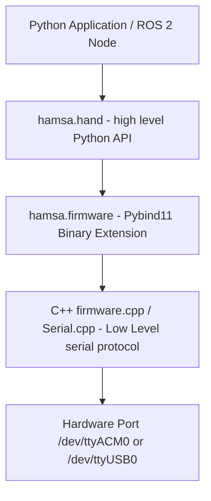

# Hamsa Robot Nano Hand - Container Setup & Python Usage Guide

This guide provides a comprehensive analysis, step-by-step setup procedure, and usage instructions for the **Hamsa Robot Nano Hand** control library inside the Docker/container environment.

---

## 1. ⚙️ Hamsa Library Architecture

The Hamsa library is a hybrid package that combines low-level **C++ hardware control** with a high-level **Python wrapper**:



* **`src/cpp/`**: Contains C++ files for Serial communication (`Serial.cpp`) and packet generation.
* **`src/binding/`**: Contains `binder.cpp` which exposes C++ methods to Python using `pybind11`.
* **`src/hamsa/`**: High-level Python modules (like `hand.py`, `poses.py`) that parse configuration files and call the compiled C++ firmware extension.

---

## 2. 🔌 Step 1: USB Port Configuration (`Serial.cpp`)

The low-level C++ module communicates via serial. Depending on which port the physical hand is mapped to in the container, you must edit the port path.

1. Open [Serial.cpp](file:///home/khy/153.open_arm_setup_container_ws/src/hamsa/src/cpp/Serial.cpp).
2. Locate the constructor starting at line 26:
   ```cpp
   CSerial::CSerial()
   {
       IOTimeOut = 2;
       USB = open( "/dev/ttyACM0", O_RDWR| O_NOCTTY| O_NONBLOCK ); // Change port here
   ```
3. Update `"/dev/ttyUSB0"` to `"/dev/ttyACM0"` (or whichever port is active on your device).

---

## 3. 🛠️ Step 2: Build & Global Installation

Since `hamsa` contains C++ files, changing `Serial.cpp` requires re-compilation. Because container environments often have system-level write protections for standard users, you **must use `sudo`** to ensure the library is installed into the global Python environment. 

Run the following commands inside the `hamsa` folder inside your container:

```bash
# 1. Navigate to the hamsa directory
cd /home/rastech/workspace/src/hamsa

# 2. Compile and install to global site-packages
sudo pip install -e . --break-system-packages
```

> [!NOTE]
> * `-e` (editable) installs a link to your source directory so any changes in Python files are immediately updated.
> * `--break-system-packages` allows `pip` to bypass PEP 668 constraints in modern Linux/Ubuntu distros.

---

## 4. 🎛️ Step 3: Crucial Parameter Setup (`hamsa.config`)

The `hand.py` script reads the finger joint limit configuration from a configuration file. The lookup path is hardcoded as:
`$HOME/robothand/hamsa/hamsa.config`

If the folder or file does not exist, `configparser.read()` **fails silently** (returns an empty list), and calling any hand movement functions will crash with a **`KeyError: 'pinky curl'`**.

### 🔧 Initialization Command:
Run this inside your terminal to copy the workspace config to the expected path in your home directory:

```bash
# Create the directory
mkdir -p $HOME/robothand/hamsa

# Copy the configuration file
cp /home/khy/153.open_arm_setup_container_ws/src/hamsa/hamsa.config $HOME/robothand/hamsa/hamsa.config
```

---

## 5. 🐍 Python Code Examples & Gestures

Once compiled and configured, you can control the hand by importing `hand` from the `hamsa` package.

Here is a full test script (`hamsa_test.py`) mapping the key wiggling (spreading) and curling (flexing) commands:

```python
import os
import sys
import time

# Ensure we import the correct library
from hamsa import hand

# 1. close_palm (좁히기)
def close_palm():
    hand.wiggle_pinky(0, 1000)
    hand.wiggle_ring(0, 1000)
    hand.wiggle_middle(1, 1000)
    hand.wiggle_index(1, 500)
    hand.wiggle_thumb(1, 1000)

# 2. open_palm (펼치기)
def open_palm():
    hand.wiggle_pinky(1, 1000)
    hand.wiggle_ring(1, 1000)
    hand.wiggle_middle(1, 2000)
    hand.wiggle_index(0, 500)
    hand.wiggle_thumb(0, 1000)

# 3. grab (구부리기)
def grab():
    hand.curl_pinky(0, 2000)
    hand.curl_ring(0, 2000)
    hand.curl_middle(0, 2000)
    hand.curl_index(0, 2000)
    hand.curl_thumb(0, 2000)

# 4. release (펼치기)
def release():
    hand.curl_pinky(1, 2000)
    hand.curl_ring(1, 2000)
    hand.curl_middle(1, 2000)
    hand.curl_index(1, 2000)
    hand.curl_thumb(1, 1800)

# 5. scissor (가위)
def scissor():
    hand.curl_pinky(0, 1000)
    hand.curl_ring(0, 1000)
    hand.curl_thumb(0, 1000)
    hand.curl_middle(1, 1000)
    hand.curl_index(1, 1000)

if __name__ == '__main__':
    print("Executing Scissor motion...")
    scissor()
    time.sleep(2)
    
    print("Executing Release motion...")
    release()
    time.sleep(2)
```

---

## 🔍 6. Troubleshooting Common Errors

### 🔴 Error A: `ModuleNotFoundError: No module named 'hamsa'`
* **Cause**: The package was installed to the local user-site packages directory (e.g. `~/.local`) which is not in Python's `sys.path`.
* **Fix**: Re-install the package using `sudo`:
  ```bash
  sudo pip install -e . --break-system-packages
  ```

### 🔴 Error B: `KeyError: 'pinky curl'`
* **Cause**: `hamsa.config` was not found in `~/robothand/hamsa/hamsa.config`.
* **Fix**: Create the folder and copy the file:
  ```bash
  mkdir -p $HOME/robothand/hamsa
  cp /home/khy/153.open_arm_setup_container_ws/src/hamsa/hamsa.config $HOME/robothand/hamsa/hamsa.config
  ```

### 🔴 Error C: `Error 9 from tcgetattr: Bad file descriptor` / `Error 9 from tcsetattr`
* **Cause**: The C++ serial driver tried to configure a port that is either closed, does not exist, or you lack permission to write to.
* **Fix**:
  1. Confirm your USB device is recognized: `ls -la /dev/ttyACM*` or `ls -la /dev/ttyUSB*`.
  2. Grant read/write permissions to the port:
     ```bash
     sudo chmod 666 /dev/ttyACM0
     ```
  3. Ensure the active port is correctly matched in [Serial.cpp](file:///home/khy/153.open_arm_setup_container_ws/src/hamsa/src/cpp/Serial.cpp) and that the package was subsequently rebuilt with `sudo pip install -e . --break-system-packages`.
