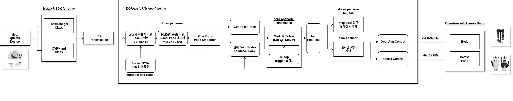

<div class="page-break"></div>
## 목차
- [0. 사용된 프레임워크](#0-사용된-프레임워크) 
- [1. 프로젝트 개요](#1-프로젝트-개요)
- [2. 아키텍처 구성](#2-아키텍처-구성)
- [3. 아키텍처 컴포넌트 별 세부 설명](#3-아키텍처-컴포넌트-별-세부-설명)
- [4. 파라미터 요약](#4-파라미터-요약)
- [5. 발생한 문제점 및 적용 기술](#5-발생한-문제점-및-적용-기술)
- [6. 부록](#6-부록)

<div class="page-break"></div>

### 0. 사용된 프레임워크
#### DORA.rs
ROS2와 같은 **미들웨어용 프레임워크**로서, 데이터 처리 속도 및 통신 속도 향상을 위해 아래 기법들을 적용

- **공유 메모리(SHM)** 기반 **Zero-copy 데이터 전달**:
  - 데이터 공유 시 ==Python 바인딩(PyArrow)된 Apache Arrow 데이터를 그대로 활용한 zero-copy 방식==을 이용해, ==데이터 직렬화(Serialization) 및 비직렬화(Deserialization) 과정이 불필요==하여 직렬화 관련 오버헤드를 극적으로 절감.
- **Zenoh 통신 방식** 채택
  - 외부 노드 간 통신 시 DDS 대신 Zenoh를 주 방식으로 사용하여 ==통신 오버헤드 감소 및 데이터 전송 속도 증가==.
- **Rust 언어** 기반 구현:
  - C++ 대신 ==Rust 기반으로 구현되어 메모리 안전성 관리가 용이함 (예: Segmentation fault 발생 X) ==

> **특성 요약**
> 	위 특성으로 인해 ROS2 대비 전반적인 **Latency** 및 **Throughput**이 매우 우수함. 이는 가상 현실(VR) 헤드셋(HMD)을 제어 입력기로 연결하고 로봇 하드웨어를 원격 조종하는 Master-Slave VR Teleop 구축 시, 제어 입력의 실시간 데이터성이 최우선인 환경에 매우 적합함.

<div class="page-break"></div>
#### MuJoCo
Google DeepMind가 오픈소스로 공개하고 있는 대표적인 High-performance 물리 시뮬레이션 및 다자유도 관절 동역학 엔진.

- **관절 튀김 / 파괴 없는 수치 안정성**:
  - 일반화 좌표계(Minimal Coordinates)를 사용하여 ==고속 제어나 강한 물리 접촉 중에도 관절 제약이 끊어지지 않음==.
- **압도적인 계산 속도 및 초경량**:
  - C 기반 코어로 작성되어 ==CPU 단일 코어만으로 초당 수천~수만 Hz 연산이 가능하며, 메모리 점유가 극도로 적음==.

| 비교 항목　　　　　　　　　| Gazebo (Classic / Ignition)　　　　　　　　　　　　　　　 | MuJoCo (Google DeepMind)　　　　　　　　　　　　　　　　　　　|
| :---------------------------| :----------------------------------------------------------| :--------------------------------------------------------------|
| 1. 관절 수치 안정성　　　　| 고속 이동 시 조인트 덜덜 떨림 및 튕김 현상 발생 가능　　　| 고속 제어 및 급격한 동작에도 관절 찢어짐 없이 안정적 유지　　 |
| 2. HW 사양 & 구동 속도　　 | ROS 메시지 통신 및 OGRE 렌더링으로 CPU/RAM 사용량 높음　　| 설치가 가볍고 CPU 단일 코어만으로 초당 수천 Hz 연산 가능　　　|
| 3. 설치 및 초기 진입장벽　 | `apt-get` 및 ROS 패키지 기반으로 표준 설치 용이　　　　　 | `pip install mujoco` 한 줄로 즉시 설치되어 진입장벽 최소　　　|
| 4. IK / 관절 제어 연동성　 | MoveIt2 등의 ROS 서비스/액션 아키텍처 설정 필요　　　　　 | Python 코드 내 `mink` QP IK 솔버와 포인터 수준 가볍게 직결　　|
| 5. 마찰 & 미세 접촉 정확도 | 다자유도 손가락 접촉 시 미끄러짐 및 투과 현상 발생　　　　| Convex QP 기반 물리 솔버로 미세 접촉 및 마찰력 정밀 계산　　　|
| 6. 렌더링 & 시각적 화질　　| OGRE 기반 3D 그래픽 지원 (일반적인 로봇 시뮬레이션 수준)　| OpenGL 기반 기본 Passive Viewer로 단순 뷰어 역할 수행　　　　 |
| 7. 3D 센서 시뮬레이션　　　| LiDAR, Depth 카메라, IMU 등 다양한 ROS 센서 플러그인 제공 | 센서 시뮬레이션 기능이 약함 (기본 RGB/Depth 카메라 연산 수준) |
| 8. 대규모 병렬 학습 (DRL)　| 단일 프로세스 중심 구조로 대규모 병렬 환경 구성 불가　　　| CPU 멀티프로세스 기반 병렬 구동 지원　　　　　　　　　　　　　|

> **특성 요약**
> 	- 일반화 좌표계와 Convex QP 기반 물리 솔버를 사용하여 고속 제어 및 급격한 동작에도 관절이 안정적으로 유지되며 미세 접촉과 마찰력을 정밀하게 계산함
> 	
> 	- C 기반 코어로 작성되어 메모리 점유가 적고 CPU 단일 코어로 초당 수천~수만 Hz 연산이 가능하며, `pip install` 명령어로 즉시 설치할 수 있어 진입 장벽이 낮음. 
> 	
> 	- 파이썬 코드 내에서 `mink` QP IK 솔버와 포인터 수준으로 가볍게 직결되고 CPU 멀티프로세스 기반 병렬 구동을 지원하나, 센서 시뮬레이션 기능은 비교적 약함.


<div class="page-break"></div>

### 1. 프로젝트 개요
본 프로젝트는 사람의 수화(Sign Language) 동작에 포함된 **손가락**과 **팔**의 연속적인 궤적을 Meta Quest3(OVManager, OVHand) 통해서 OpenArm 기반 NANA에 실시간 모사하는 것을 목표로 합니다.

- **양팔 Teleop**: 7-DOF 팔 Teleop (진행 완료)
- **손가락 Teleop**: 10-DoF 손가락 Teleop (진행 예정)

#### Tracking을 위한 Meta Quest3 SDK 정보
##### OVManager
- **컨트롤러(or 손목) 포즈 데이터 제공:** 컨트롤러-손 추적(Hand Tracking) Pose 반환
- **통합 제어 싱글톤:** Quest 기기 전반의 시스템 설정 및 런타임 상태를 총괄 관리하는 핵심 메인 컴포넌트

##### OVHand
- **손가락(25 keypoints) 데이터 제공:** 손가락 마디별 3D 위치, 회전값, 뼈대(Skeleton) 계층 구조 정보 실시간 추출
- **제스처 및 신뢰도 감지:** 집기(Pinch) 동작의 세기, 손가락 굽힘 상태, 추적 신뢰도(Tracking Confidence) 측정
- **맨손 상호작용 구현:** 물리 기반 손 커스텀 및 Interaction SDK와 연동하여 버튼 누르기, 물체 집기 등 UI/체험 구현
- **좌우 손 구분 제어:** Left/Right Hand 타입을 지정하여 개별 시각화(Mesh Renderer) 및 콜라이더 자동 생성

##### OVBodyTracking (Unstable ⚠️) 
- **상반신 및 전신 포즈 추정:** 상체 카메라(IOBT)와 헤드셋/컨트롤러/손 위치 추적을 합성하여 전신에 대한 3D 관절(Joint) 포즈 추론    
- **3D 아바타 리타겟팅(Retargeting):** 추정된 사용자 신체 움직임을 캐릭터 리그(Humanoid Rig)에 매핑하여 아바타 동작 동기화   
- **피트니스 및 동작 분석:** 사용자의 자세 검출, 운동 제스처 비교, 게임 내 피격 판정 등에 활용
- **⚠️ Unstable :**  WebXR 표준으로 채택이 안되어 있어서, API 스펙 변경 가능성이 높음

<div class="page-break"></div>


### 2. 아키텍처 구성


#### dora-openarm-vr
- **역할**: Meta Quest 3 VR 헤드셋 및 핸드 컨트롤러 포즈 데이터 수신 노드. (Not yet, 손가락 데이터)
- **주요 기능**: 5006 포트 UDP 패킷 수신, One Euro Filter를 이용한 노이즈 제거 및 핸드 컨트롤러(혹은 손목)에 대한 Target Pose 전처리

#### dora-openarm-kinematics
- **역할**: mink QP 솔버 기반 역운동학(IK) 및 순운동학(FK) 연산 노드.
- **주요 기능**: Target Pose를 수신하여 `dora_openarm_kinematics_control`을 통해 MuJoCo 모델 기반 다자유도(양팔 14-DOF) 관절 각도(Joint Angles)를 실시간 연산.

#### dora-openarm-mujoco
- **역할**: 3D 시뮬레이션 및 모션 시각화 Viewer 노드.
- **주요 기능**: IK 결과 Teleop되는 실시간 로봇을 MuJoCo 뷰어 상에 실시간 TF Axes와 함께 렌더링.

#### dora-openarm (controller)
- **역할**: 실제 OpenArm 로봇 팔 하드웨어 모터 제어 노드.
- **주요 기능**: `openarm_driver`와 CAN-FD 통신을 연동하여 IK에서 계산된 관절 각도 목표값을 실시간 하드웨어 전송 및 상태 피드백.

<div class="page-break"></div>

### 3. 아키텍처 컴포넌트 별 세부 설명
> 각 모듈별 상세 스펙과 동작 가이드

#### NANA OpenArm Description
- [00. NANA OpenArm Description](./00_nana_openarm_description.md) - NANA v3 로봇 물리 모델링 및 URDF/XML 관절 명세
#### Dora OpenArm VR
- [01. Dora OpenArm VR](./01_dora_openarm_vr.md) - Quest VR 데이터 수신 및 One Euro 필터링 세부 설명
#### Dora OpenArm Kinematics
- [02. Dora OpenArm Kinematics](./02_dora_openarm_kinematics.md) - IK/FK 기능에 대한 Wrapper 및 파라미터 가이드
#### Dora OpenArm Kinematics Control
- [03. Dora OpenArm Kinematics Control](./03_dora_openarm_kinematics_control.md) - Mink QP 솔버 백엔드 커스텀 모듈 세부 설명
#### Dora OpenArm MuJoCo
- [04. Dora OpenArm MuJoCo](./04_dora_openarm_mujoco.md) - MuJoCo 3D 시뮬레이터 뷰어 설명
#### Dora OpenArm
- [05. Dora OpenArm](./05_dora_openarm.md) - 로봇 팔 컨트롤러 노드(Follower Left/Right) 동작 세부 설명
#### OpenArm Driver
- TBD
#### Hamsa Driver
- TBD

<div class="page-break"></div>

### 4. 파라미터 요약
#### 1) openarm_driver 하드웨어 설정 파라미터 예시 (`nana_v3_cell_v4.yaml`)
> 실제 NANA v3 로봇의 CAN-FD 통신 버스, 관절 제한, 모터 타입, 제어 득인(KP/KD), 초기 및 종료 이동 궤적을 정의하는 핵심 하드웨어 설정 파일

```yaml
# ==============================================================================
# NANA v3 OpenArm 하드웨어 및 셀 설정 파일 (nana_v3_cell_v4.yaml)
# ==============================================================================

# 1. 관절 안전 가동 범위 [min, max] (단위: radian)
# NANA v3 셀 구조체 및 보수적 파손 방지를 위한 안전 소프트웨어 리밋
joint_limits:
  right_arm:
    - [-1.0472, 1.5708]    # Joint 1 (Shoulder Pitch) : -60° ~ +90°
    - [-1.22173, 1.22173]  # Joint 2 (Shoulder Roll)  : -70° ~ +70°
    - [-1.04719, 1.04719]  # Joint 3 (Shoulder Yaw)   : -60° ~ +60° (수화 표현 보장 & 꺾임 방지)
    - [0.0, 2.0944]        # Joint 4 (Elbow Pitch)    : 0° ~ +120°
    - [-1.04719, 1.04719]  # Joint 5 (Wrist Yaw)     : -60° ~ +60°
    - [-0.785398, 0.785398]# Joint 6 (Wrist Pitch)   : -45° ~ +45°
    - [-1.04719, 1.04719]  # Joint 7 (Wrist Roll)    : -60° ~ +60°
    - [-1.047198, 0.4]     # Joint 8 (Right Gripper)
  left_arm:
    - [-1.0472, 1.5708]    # Joint 1 (Shoulder Pitch) : -60° ~ +90°
    - [-1.22173, 1.22173]  # Joint 2 (Shoulder Roll)  : -70° ~ +70°
    - [-1.04719, 1.04719]  # Joint 3 (Shoulder Yaw)   : -60° ~ +60°
    - [0.0, 2.0944]        # Joint 4 (Elbow Pitch)    : 0° ~ +120°
    - [-1.04719, 1.04719]  # Joint 5 (Wrist Yaw)     : -60° ~ +60°
    - [-0.785398, 0.785398]# Joint 6 (Wrist Pitch)   : -45° ~ +45°
    - [-1.04719, 1.04719]  # Joint 7 (Wrist Roll)    : -60° ~ +60°
    - [-1.047198, 0.4]     # Joint 8 (Left Gripper)

# 2. 관절 하드웨어 0점 영점 오프셋 (단위: radian)
joint_offsets:
  right_arm: [0.0, 0.0, 0.0, 0.0, 0.0, 0.0, 0.0, 0.0]
  left_arm:  [0.0, 0.0, 0.0, 0.0, 0.0, 0.0, 0.0, 0.0]

# 3. 스텝당 최대 관절 속도 제한 (단위: rad/s)
# 텔레옵 급격한 수부 이동 시 로봇 관절의 순간 가속을 억제하는 안전 속도 한계선
joint_delta_position_limits:
  - 0.8  # J1 (DM8009 어깨 Pitch) : 최대 ~45°/s
  - 0.8  # J2 (DM8009 어깨 Roll)  : 최대 ~45°/s
  - 0.6  # J3 (DM4340 어깨 Yaw)   : 최대 ~34°/s
  - 1.0  # J4 (DM4340 팔꿈치)     : 최대 ~57°/s
  - 0.8  # J5 (DM4310 손목 Yaw)   : 최대 ~45°/s
  - 0.8  # J6 (DM4310 손목 Pitch) : 최대 ~45°/s
  - 0.8  # J7 (DM4310 손목 Roll)  : 최대 ~45°/s
  - 0.4  # J8 (그리퍼)

# 4. Linux SocketCAN 인터페이스 디바이스 매핑
can_interface:
  right_arm: "can0"  # 오른팔 모터 버스 연결 인터페이스
  left_arm:  "can1"  # 왼팔 모터 버스 연결 인터페이스

# 5. 관절 모터 하드웨어 타입 및 CAN 수발신 ID 정의
motor_config:
  types: ['DM8009', 'DM8009', 'DM4340', 'DM4340', 'DM4310', 'DM4310', 'DM4310', 'DM4310']
  send_ids: [0x01, 0x02, 0x03, 0x04, 0x05, 0x06, 0x07, 0x08]
  recv_ids: [0x11, 0x12, 0x13, 0x14, 0x15, 0x16, 0x17, 0x18]

# 6. 하드웨어 PD 제어 게인 설정 (Proportional & Derivative Gains)
control_gains:
  kps: [85.0, 85.0, 80.0, 75.0, 10.0, 10.0, 10.0, 10.0]
  kds: [ 3.2,  3.0,  2.5,  2.5,  0.7,  0.6,  0.5,  0.2]

# 7. 구동 개시 모션 설정 (Start Registration Pose: A-Pose)
start:
  moves:
    - name: "a_pose"
      position:
        right_arm: [0.436332, 0.0, 0.0, 1.39626, 0.0, 0.0, 0.0, 0.0]
        left_arm:  [-0.436332, 0.0, 0.0, 1.39626, 0.0, 0.0, 0.0, 0.0]
      hz: 50
      duration: 2

# 8. 안전 정지 모션 설정 (Attention Zero Pose)
stop:
  moves:
    - name: "initial"
      position:
        right_arm: [0.0, 0.0, 0.0, 0.0, 0.0, 0.0, 0.0, 0.0]
        left_arm:  [0.0, 0.0, 0.0, 0.0, 0.0, 0.0, 0.0, 0.0]
      hz: 50
      duration: 2
```

<div class="page-break"></div>


#### 2) dora-openarm-vr 수신기 파라미터
> Meta Quest 3 UDP 데이터 수신, 스케일 변환 및 One Euro Filter 스무딩 관련 파라미터입니다.

| 파라미터 항목          |  대표 설정값  | 파라미터 설명 및 역할                                   |
| :--------------- | :------: | :--------------------------------------------- |
| **`scale`**      |  `1.0`   | VR 조작자 손 이동 거리 $\to$ 로봇 말단 이동 거리 작업 공간 스케일링 비율 |
| **`port`**       |  `5006`  | Quest HMD로부터 텔레메트리 JSON 패킷을 수신하는 UDP 비동기 포트    |
| **`min_cutoff`** | `1.0 Hz` | One Euro Filter 정지 시 미세 수부 떨림 제거를 위한 최소 차단 주파수 |
| **`beta`**       | `0.005`  | 고속 이동 시 반응 지연(Lag)을 최소화하기 위한 속도 감응 필터 계수       |
| **`d_cutoff`**   | `1.0 Hz` | 수부 이동 속도(Derivative) 신호 필터링 차단 주파수             |

#### 3) dora-openarm-kinematics 역운동학(IK) 파라미터
>mink QP 솔버 기반 14-DOF Bimanual IK 연산 제어 파라미터입니다.

| 파라미터 항목                    |         대표 설정값          | 파라미터 설명 및 역할                                       |
| :------------------------- | :---------------------: | :------------------------------------------------- |
| **`--xml`**                | `nana_v3_corrected.xml` | 역운동학 자코비안 연산의 기준이 되는 NANA v3 로봇 XML 파일             |
| **`--mode`**               |       `bimanual`        | 역운동학 구동 모드 (`bimanual` 양팔 동시 / `right` / `left`)   |
| **`--max-iters`**          |          `10`           | 1 제어 주기당 IK QP 최적화 최대 반복 갱신 회수                     |
| **`--dt`**                 |       `0.02` (s)        | 수치 적분 시간 간격 (50Hz 속도적분 연산 기준)                      |
| **`--damping`**            |          `0.3`          | Tikhonov Regularization 특이점(Singularity) 정규화 감쇄 계수 |
| **`--lm-damping`**         |          `0.1`          | Per-task Levenberg-Marquardt 대각 감쇄 수치              |
| **`--posture-cost`**       |         `0.05`          | 널스페이스(Null-space) 중립 홈 포즈 유지 작업 가중치                |
| **`--reach-posture-cost`** |         `0.001`         | 먼 거리 도달 시 유연 자세 유지를 위한 최소 가중치                      |
| **`--reach-threshold`**    |       `0.35` (m)        | 먼 거리(35cm 이상) 도달 시 유연 자세 가중치(`0.001`) 자동 전환 임계치    |

#### 4) dora-openarm 로봇 Follower 컨트롤러 파라미터
> 실제 로봇 팔 제어 및 안전 얼라인먼트(Safety Alignment) 관련 파라미터입니다.

| 파라미터 항목               |       대표 설정값       | 파라미터 설명 및 역할                               |
| :-------------------- | :----------------: | :----------------------------------------- |
| **`align_threshold`** |    `0.05` (rad)    | IK 목표 각도와 실제 관절 각도 간 얼라인먼트 수렴 판정 임계치       |
| **`step_limit`**      | `0.001` (rad/step) | 얼라인먼트 보간 진행 시 스텝당 관절 최대 이동 허용량 (급격한 튀김 방지) |
| **`trigger`**         |    `"gripper"`     | 안전 얼라인먼트 개시 트리거 모드 (그리퍼 작동 감지 시 제어 개시)     |

<div class="page-break"></div>

### 5. 발생한 문제점 및 적용 기술
#### 1) VR 트래킹 노이즈 및 신체 비율/작업 공간(Workspace) 차이 문제
- **문제점**: Meta Quest 3 VR 헤드셋 및 컨트롤러의 원시 데이터는 수부 미세 떨림(Jittering), 순간적인 트래킹 단절/가림(Occlusion), 그리고 사람과 로봇 간 상체 신체 비율 및 가동 공간 차이로 인해 관절 명령 튀김 및 포즈 왜곡 현상이 발생함.
- **적용 및 해결 기술 (`dora-openarm-vr`)**:
  - **좌표계 및 작업 공간 매핑 (Workspace Mapping)**: Unity 왼손 좌표계를 MuJoCo 오른손 좌표계로 변환 후, HMD 시점 기준 상대 포즈($\mathbf{p}_{\text{rel}}$)에 사람-로봇 신체 비율 스케일링($1.3\times$) 및 NANA v3 가슴 원점(`arm_origin` site) 기준 $90^\circ$ 회전 정렬($\mathbf{R}_{\text{fix}}$)을 적용하여 작업 공간 왜곡을 보정함.
  - **One Euro Filter 적응형 스무딩**: 정지 상태에서는 미세 떨림을 완전 제거(`min_cutoff=1.0 Hz`)하고, 고속 이동 시 반응 지연을 최소화(`beta=0.005`)하는 속도 감응형 차단 주파수 필터링 적용.
  - **트래킹 유효성 상태 기계 (Validity Logic)**: 트래킹 단절 코드(`STALE`/`INVALID`) 발생 시 직전 포즈 보존 및 재연결 시 스무더 초기화를 수행하여 센서 재복구 시 급격한 위치 튀김(Jump)을 차단함.

#### 2) mink QP 기반 다중 제약 차분 역운동학(Differential IK) 최적화
- **문제점**: 7-DOF 여유 자유도로 인한 관절 기괴 꺾임, 미사용 상체 관절(몸통/머리)의 의도치 않은 흔들림, 물리적 가동 범위 초과 및 관절 펴짐 시 특이점(Singularity) 근처 역행렬 수치 폭발 문제 발생.
- **적용 및 해결 기술 (`dora-openarm-kinematics` & `dora-openarm-kinematics-control`)**:
  - **다중 태스크 & 제약조건 구속 (DAQP QP Solver)**:
    - **Soft Objectives (Tasks)**: End-Effector 6D 타겟 포즈 추종 (`FrameTask`) 및 7-DOF 여유 자유도 내 중립 홈 포즈 유지 (`PostureTask`).
    - **Hard Inequality Limits**: 관절 물리 가동 범위 및 속도 한계 절대 초과 불가 구속 (`ConfigurationLimit`).
    - **Hard Equality Constraints**: 미사용 관절 속도를 0으로 엄격히 고정 (`DofFreezingTask`).
  - **Reach Threshold 가중치 적응 변환**: EE 타겟 거리가 임계치(`0.35m`)를 초과하면 `posture_cost`를 `0.05`에서 `0.001`로 자동으로 낮추어 자세 구속을 해제하고 먼 거리까지 팔을 유연하게 끝까지 펼칠 수 있도록 구현.
  - **수치 특이점 감쇄 (Tikhonov & LM Damping)**: Global Damping 계수(`0.3`) 및 Levenberg-Marquardt 계수(`0.1`)를 적용하여 관절 특이점 근처에서 관절 속도가 무한대로 발산하는 수치 불안정성을 차단.

#### 3) Teleop 시작 시 목표-실제 관절 오차로 인한 하드웨어 제어 위험 및 안전 얼라인먼트
- **문제점**: 텔레옵 개시 또는 재연결 시, VR 컨트롤러 기반 IK 목표 관절 각도($\mathbf{q}_{\text{target}}$)와 실제 모터 인코더 각도($\mathbf{q}_{\text{current}}$) 간 갭이 클 경우, 초기 제어 명령이 과도하여 하드웨어 파손 및 급격한 모터 튀김(Jerking) 위험이 발생함.
- **적용 및 해결 기술 (`dora-openarm`)**:
  - **`ArmStatus` 3단계 제어 상태 기계**: `STOPPED` $\to$ `STARTED` $\to$ `ALIGNED` 상태로 세분화하여 제어 전환 관리.
  - **안전 얼라인먼트 수치 보간 (`_align`)**: 관절 오차가 정합 임계치 이내로 좁혀지기 전까지는 IK 목표각으로 직접 제어하지 않고, 스텝당 허용 이동량을 `step_limit` (`0.001 rad/step`, 250Hz 루프 기준 초당 약 $0.057^\circ$ 제한)으로 클리핑하여 부드럽게 점진 추종하도록 보간 처리.
  - **자동 1:1 직결 전환**: 모든 관절 오차가 `align_threshold` (`0.05 rad`) 이내로 수렴하면 `ALIGNED` 상태로 자동 전환되어 1:1 실시간 직결 텔레옵 구동 개시.

#### 4) 특이점 회피 및 하드웨어 보호를 위한 시작(A-Pose) 및 종료(Attention Zero Pose) 시퀀스
- **문제점**: 관절이 일직선으로 완전히 펴진 완전 차렷 자세(Joint All Zero)는 역운동학 자코비안 행렬의 특이점(Singularity)에 해당하여 초기화 직후 IK 연산 실패 및 과도한 관절 가속을 유발함.
- **적용 및 해결 기술 (`openarm_driver` & `nana_v3_cell_v4.yaml`)**:
  - **Start Registration Pose (A-Pose)**: 구동 개시 시 어깨와 팔꿈치를 부드럽게 굽힌 A-Pose로 먼저 안전하게 이동한 후 IK 텔레옵 제어를 시작하여, 초기 연산 상태를 관절 가동 범위 중앙 부근의 안정 영역에 위치시킴.
  - **Attention Zero Pose (안전 정지 모션)**: 텔레옵 구동 종료 시 자중 및 기계적 간섭을 최소화하는 안전 차렷 자세로 정밀 복귀시킨 후 하드웨어 모터 구동을 정상 종료.

#### 5) 하드웨어 CAN-FD 통신 버스 분리 및 실시간 IK 피드백 동기화 (Hardware Sync Loop)
- **문제점**: 양팔 14축 데이터 통신 병목으로 인한 레이턴시 및 실제 물리 로봇과 IK 내부 시뮬레이션 모델(`mink.Configuration`) 간 위치 드리프트(Drift) 누적.
- **적용 및 해결 기술 (`openarm_driver` & `dora-openarm-kinematics`)**:
  - **실시간 피드백 동기화 (`sync`)**: 실제 모터 인코더 피드백 각도(`position`)를 IK 노드로 실시간 수신하여 `mink.Configuration`을 동기화시킴으로써 모터 실측치와 모델 간 누적 오차를 제거.

<div class="page-break"></div>


### 6. 부록
- [dora_openarm_vr](https://github.com/enactic/dora-openarm-vr)
- [Open-Television](https://github.com/OpenTeleVision/TeleVision)